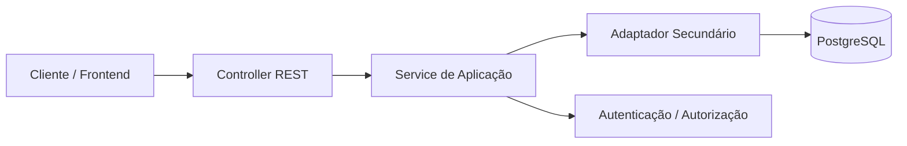

# Arquitetura proposta da API

Este projeto foi organizado com base no conceito de arquitetura hexagonal. A ideia central é separar a regra de negócio da API dos detalhes de entrada, persistência e infraestrutura, permitindo que a aplicação evolua sem ficar fortemente acoplada a NestJS, TypeORM, PostgreSQL ou Kubernetes.

## 1. Componentes da aplicação

### 1.1. Núcleo da aplicação (domínio e casos de uso)

A camada de negócio está concentrada em:

- [src/core/application/auth](src/core/application/auth)
- [src/core/application/users](src/core/application/users)
- [src/core/application/vehicle](src/core/application/vehicle)
- [src/core/application/resources](src/core/application/resources)
- [src/core/application/stock](src/core/application/stock)
- [src/core/application/services](src/core/application/services)

Nessa camada ficam os serviços principais da API, como:

- autenticação e autorização
- cadastro e gestão de usuários
- gerenciamento de veículos
- catálogo de recursos e estoque
- controle de ordens e serviços solicitados

### 1.2. Adaptadores primários

Os adaptadores primários são responsáveis por receber requisições externas e traduzir esses dados para o uso da camada de aplicação.

- [src/frameworks/primary/controllers](src/frameworks/primary/controllers): controladores REST da API
- [src/frameworks/primary/dto](src/frameworks/primary/dto): objetos de entrada e saída
- [src/frameworks/primary/guards](src/frameworks/primary/guards): autenticação e autorização
- [src/frameworks/primary/decorators](src/frameworks/primary/decorators): decoradores para contexto do usuário e permissões

Esses componentes conectam a API ao mundo externo, como clientes HTTP, Swagger e autenticação JWT.

### 1.3. Adaptadores secundários

Os adaptadores secundários encapsulam integrações com tecnologias externas e infraestrutura.

- [src/frameworks/secondary/users](src/frameworks/secondary/users)
- [src/frameworks/secondary/vehicle](src/frameworks/secondary/vehicle)
- [src/frameworks/secondary/resources](src/frameworks/secondary/resources)
- [src/frameworks/secondary/stock](src/frameworks/secondary/stock)
- [src/frameworks/secondary/services](src/frameworks/secondary/services)
- [src/infrastructure/database](src/infrastructure/database)

Esses adaptadores lidam com:

- persistência em PostgreSQL
- entidades TypeORM
- migrações de banco
- configuração de ambiente

### 1.4. Módulos de composição

Os módulos do NestJS fazem a composição das dependências da aplicação:

- [src/modules/auth](src/modules/auth)
- [src/modules/users](src/modules/users)
- [src/modules/vehicle](src/modules/vehicle)
- [src/modules/resources](src/modules/resources)
- [src/modules/stock](src/modules/stock)
- [src/modules/services](src/modules/services)
- [src/modules/fallback](src/modules/fallback)

Esses módulos conectam controladores, serviços, entidades e dependências em uma estrutura organizada.

## 2. Visão geral da arquitetura

A estrutura segue o seguinte fluxo:

1. O cliente envia uma requisição para a API.
2. O controller recebe a chamada e valida os dados de entrada.
3. O service de aplicação executa a regra de negócio.
4. O adaptador secundário realiza a comunicação com banco de dados ou outros serviços.
5. A resposta é devolvida ao cliente de forma padronizada.

## 3. Infraestrutura provisionada

A infraestrutura disponível no repositório é organizada para rodar a aplicação em ambiente containerizado e orquestrado.

### 3.1. Container da aplicação

- [Dockerfile](Dockerfile): imagem da API NestJS
- [docker-compose.yml](docker-compose.yml): ambiente local com aplicação e banco

### 3.2. Banco de dados

- PostgreSQL como banco principal
- Configuração via variáveis de ambiente e arquivos de conexão em [src/infrastructure/database](src/infrastructure/database)

### 3.3. Provisionamento com Kubernetes e Terraform

Os arquivos em [infra](infra) e [k8s](k8s) definem a infraestrutura:

- cluster Kubernetes local (via Terraform/kind)
- namespace para a aplicação
- secrets com credenciais e configuração sensível
- deployment do banco de dados
- deployment da API
- services para expor os componentes internamente
- HPA para escalonamento automático da API

### 3.4. Recursos provisionados

- um cluster Kubernetes
- um namespace dedicado
- um pod para o banco PostgreSQL
- um pod para a aplicação NestJS
- um service para o banco
- um service para a API
- um horizontal pod autoscaler para a API

## 4. Resumo executivo

A API foi estruturada como uma aplicação modular, com foco em arquitetura hexagonal. A camada de domínio concentra a lógica de negócio, enquanto os adaptadores primários e secundários isolam a entrada do sistema e suas integrações com banco de dados e infraestrutura. O provisionamento com Terraform e Kubernetes complementa essa arquitetura, permitindo que a aplicação seja implantada de forma consistente e escalável.
