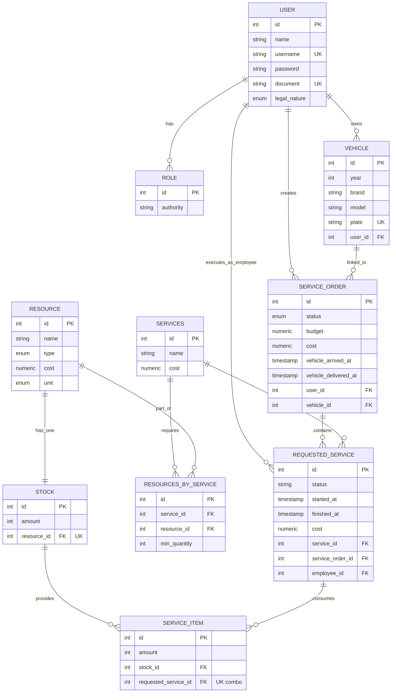
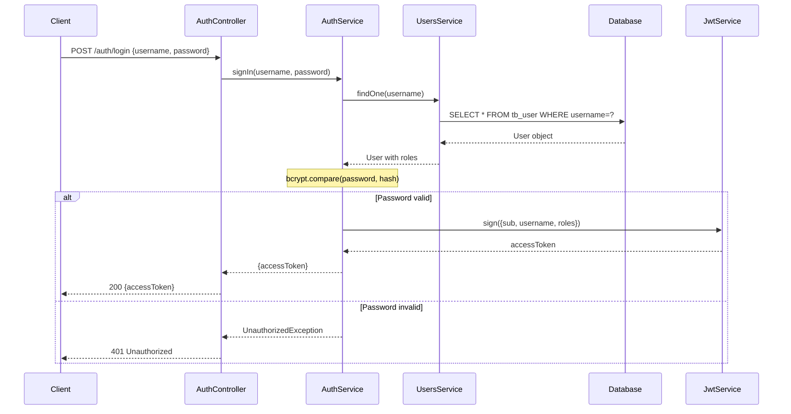
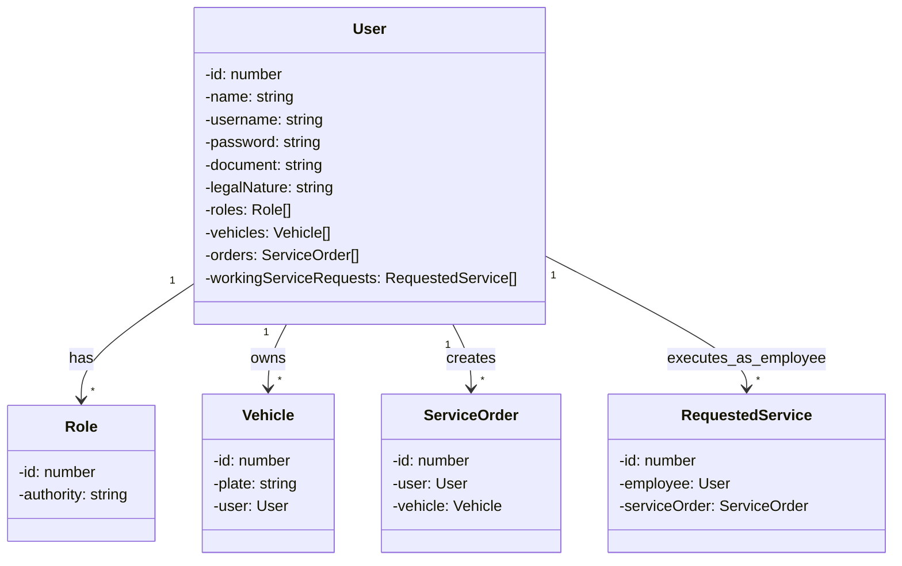
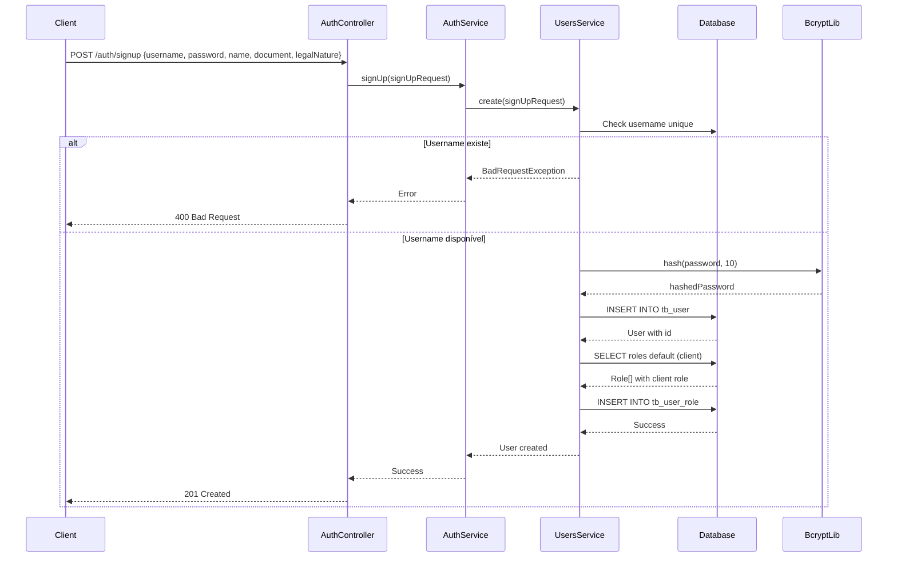
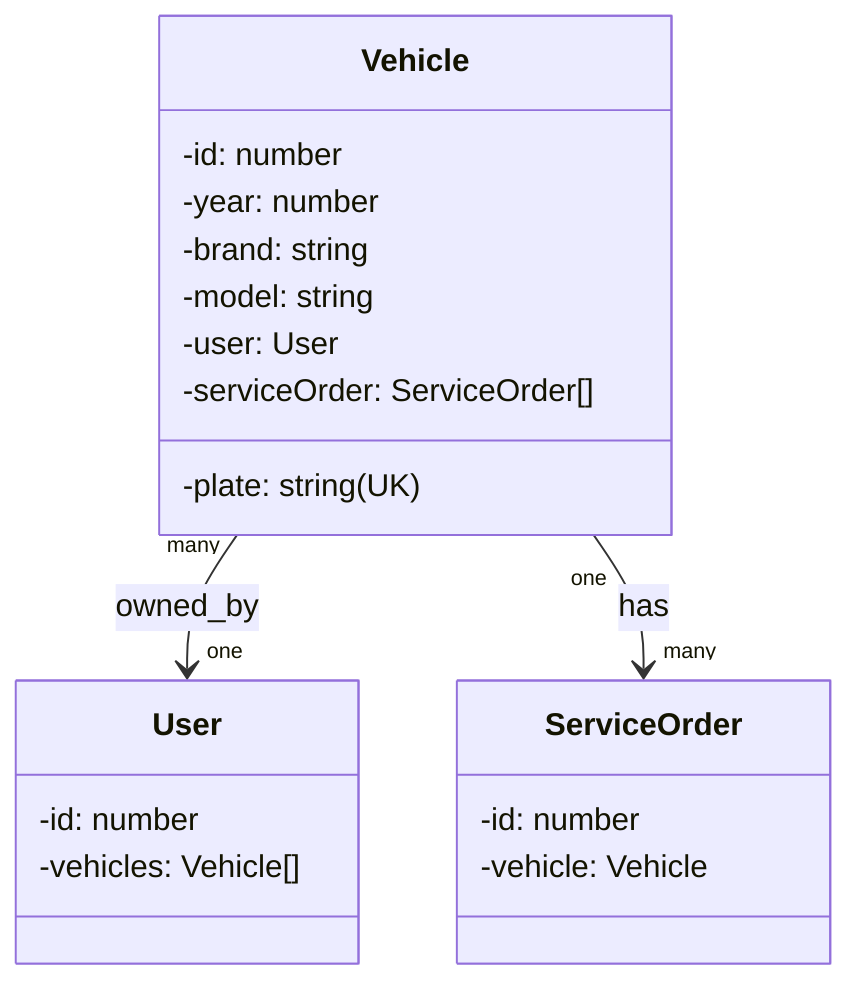
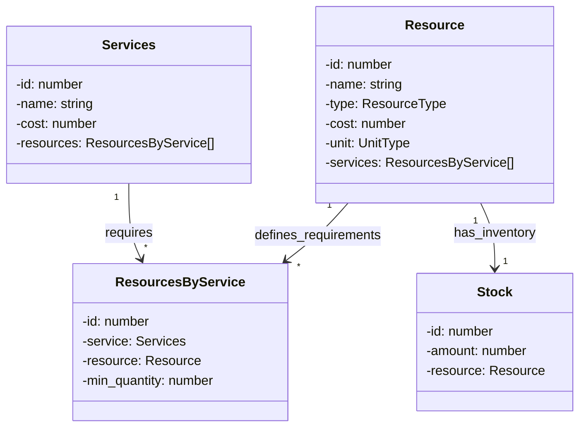
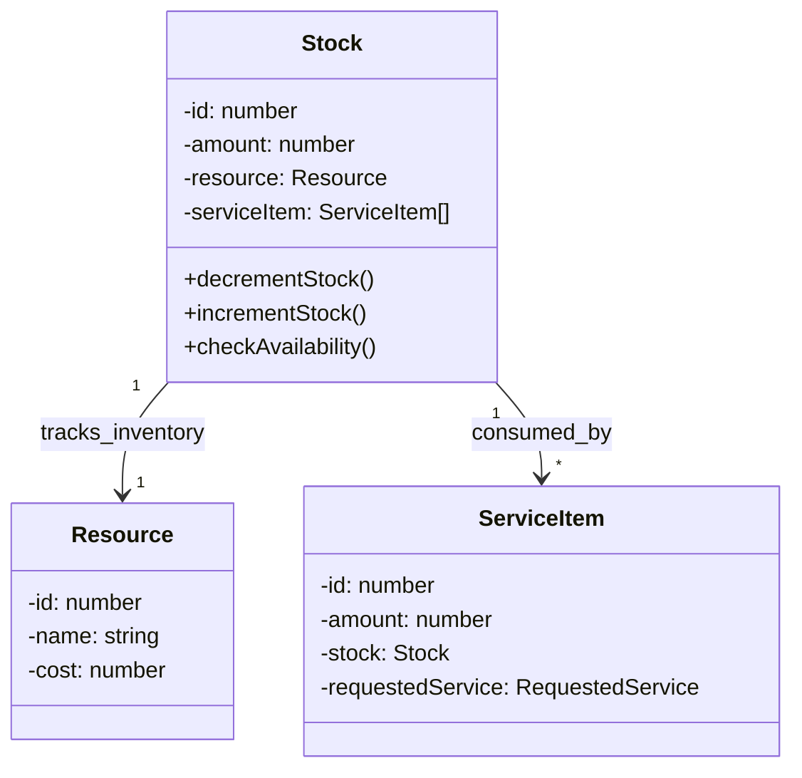
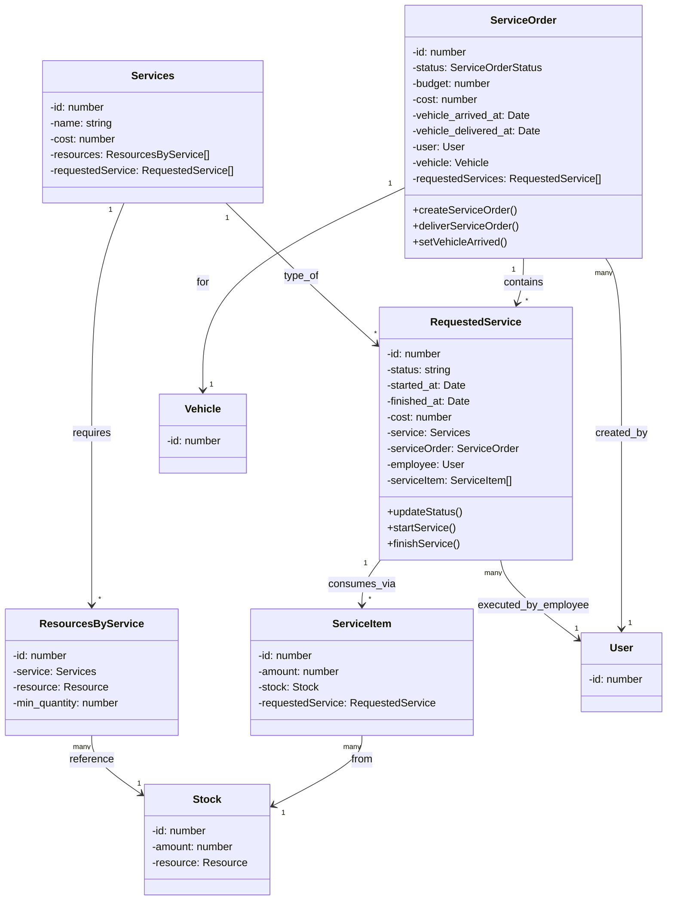
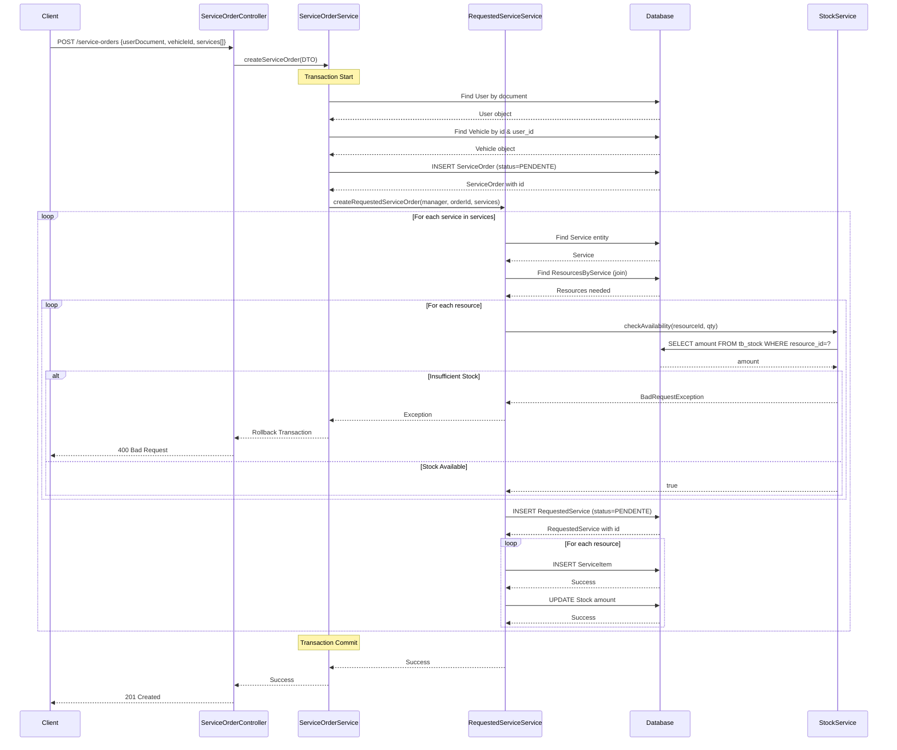
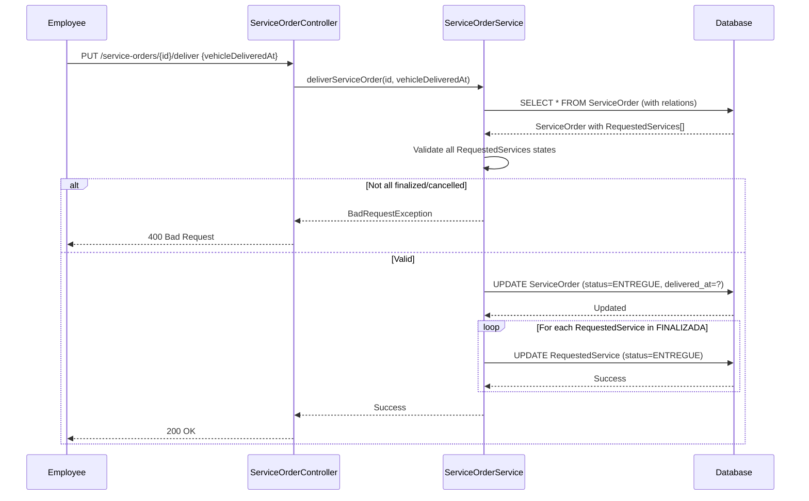

# Documentação LLD - API de Serviços Automotivos

**Documento Versão:** 1.0
**Data:** Maio 2026
**Tecnologias:** NestJS + TypeORM + PostgreSQL

---

## 📋 Índice
1. [Visão Geral](#visão-geral)
2. [Arquitetura Geral](#arquitetura-geral)
3. [Modelo de Dados](#modelo-de-dados)
4. [Módulo de Autenticação (AUTH)](#módulo-de-autenticação-auth)
5. [Módulo de Usuários (USERS)](#módulo-de-usuários-users)
6. [Módulo de Veículos (VEHICLE)](#módulo-de-veículos-vehicle)
7. [Módulo de Recursos (RESOURCES)](#módulo-de-recursos-resources)
8. [Módulo de Estoque (STOCK)](#módulo-de-estoque-stock)
9. [Módulo de Serviços (SERVICES)](#módulo-de-serviços-services)
10. [Migrations e Seeding](#migrations-e-seeding)
11. [Tratamento de Erros Global](#tratamento-de-erros-global)
12. [Restrições Técnicas](#restrições-técnicas)
13. [Testes](#testes)

---

## Visão Geral

### Propósito da API
Sistema de gerenciamento de serviços automotivos com:
- **Autenticação** baseada em JWT com controle de roles (Admin e Client)
- **Gestão de usuários** com suporte a pessoa física e jurídica
- **Cadastro de veículos** vinculados a usuários
- **Catálogo de serviços** com recursos necessários
- **Gerenciamento de estoque** de recursos/peças
- **Ordens de serviço** com rastreamento de status
- **Serviços solicitados** dentro de ordens com alocação de funcionários
- **Controle de recursos** utilizados em cada serviço (ServiceItems)

### Stack Técnico
```
Frontend Client
       ↓
NestJS Application (Controllers)
       ↓
Services Layer (Business Logic)
       ↓
TypeORM Entities (Data Mapping)
       ↓
PostgreSQL Database
```

### Fluxo de Dados Alto Nível
```
Cliente → Autenticação JWT → Autorização por Roles
    ↓
Controllers recebem requisição
    ↓
Services executam lógica de negócio
    ↓
TypeORM gerencia persistência
    ↓
Resposta → Cliente
```

---

## Arquitetura Geral

### Estrutura de Módulos

```
AppModule (raiz)
├── ConfigModule (variáveis de ambiente)
├── TypeOrmModule (conexão banco de dados)
├── AuthModule
│   ├── AuthController
│   ├── AuthService
│   ├── AuthGuard (JWT)
│   ├── RolesGuard (RBAC)
│   └── Decorators (CurrentUser, Public, Role)
├── UsersModule
│   ├── UsersController
│   ├── UsersService
│   ├── User Entity
│   ├── Role Entity
│   └── LegalNature Enum
├── VehicleModule
│   ├── VehicleController
│   ├── VehicleService
│   ├── Vehicle Entity
│   └── Utils (plate validation)
├── ResourcesModule
│   ├── ResourcesController
│   ├── ResourcesService
│   ├── Resource Entity
│   ├── ResourcesByService Entity
│   └── Enums (ResourceType, UnitType)
├── StockModule
│   ├── StockController
│   ├── StockService
│   └── Stock Entity
├── ServicesModule
│   ├── ServiceOrderController
│   ├── RequestedServiceController
│   ├── ServicesController
│   ├── ServiceOrderService
│   ├── RequestedServiceService
│   ├── ServicesService
│   ├── Services Entity
│   ├── ServiceOrder Entity
│   ├── RequestedService Entity
│   ├── ServiceItem Entity
│   └── Enums (ServiceOrderStatus, RequestedServicesStatus)
└── FallbackModule
    └── FallbackController (wildcard routes)
```

### Padrões de Projeto Utilizados

| Padrão | Implementação | Benefício |
|--------|---------------|-----------|
| **MVC** | Controllers → Services → Entities | Separação de responsabilidades |
| **Dependency Injection** | @Injectable + constructor | Desacoplamento e testabilidade |
| **Repository Pattern** | @InjectRepository | Abstração da persistência |
| **Guards** | AuthGuard, RolesGuard | Segurança e autorização |
| **Decorators** | @CurrentUser, @Public, @Role | Metaprogramação limpa |
| **Transactions** | DataSource.transaction | Consistência em operações multi-entidade |
| **Pipes** | ValidationPipe | Validação automática de DTOs |

---

## Modelo de Dados

### Diagrama de Entidades (Relationships)



### Constraints e Regras

| Entidade | Constraint | Descrição |
|----------|-----------|-----------|
| **User** | `username UNIQUE` | Cada usuário precisa de username único |
| **User** | `document UNIQUE` | Cada usuário tem um documento único (CPF/CNPJ) |
| **Vehicle** | `plate UNIQUE` | Placa de veículo é identificador único |
| **Vehicle** | FK user CASCADE | Deletar usuário deleta seus veículos |
| **Stock** | `resource_id UNIQUE` | Um único registro de estoque por recurso |
| **Stock** | FK resource CASCADE | Deletar recurso deleta seu estoque |
| **ServiceItem** | `(stock_id, requested_service_id) UNIQUE` | Impede uso múltiplo do mesmo item em um serviço |

---

## Módulo de Autenticação (AUTH)

### Responsabilidade
Gerenciar autenticação de usuários e autorização baseada em roles (RBAC - Role-Based Access Control).

### Componentes

#### 1. **AuthService**
```typescript
class AuthService {
  async signIn(username: string, password: string): Promise<{ accessToken: string }>;
  async signUp(signUpRequest: SignUpRequest): Promise<void>;
}
```

**Fluxo de signIn:**
1. Buscar usuário por username no banco
2. Comparar senha fornecida com hash bcrypt armazenado
3. Se falhar, lançar `UnauthorizedException`
4. Se passar, extrair roles do usuário
5. Gerar JWT token com payload: `{sub: userId, username, roles}`
6. Retornar accessToken

**Fluxo de signUp:**
1. Validar DTO (SignUpRequest)
2. Delegar para `UsersService.create()` para criar novo usuário
3. Usuário criado recebe roles padrão (definidas em migrations)

#### 2. **AuthGuard (JWT)**
```typescript
class AuthGuard extends PassportStrategy(Strategy) {
  async validate(payload: any) {
    // Valida token JWT
    // Injeta user no contexto da requisição via @CurrentUser()
  }
}
```

**Comportamento:**
- Intercepta todas as rotas protegidas
- Valida assinatura do JWT
- Extrai payload
- Se inválido, retorna `401 Unauthorized`
- Se válido, permite continuação

#### 3. **RolesGuard (RBAC)**
```typescript
class RolesGuard implements CanActivate {
  canActivate(context: ExecutionContext): boolean {
    // Verifica se user possui roles necessários
    // Compara com @Role decorator da rota
  }
}
```

**Lógica:**
1. Obter roles requeridos da metadata da rota (`@Role('admin', 'employee')`)
2. Obter roles do usuário do JWT token
3. Verificar intersecção de roles
4. Se sem interseção, retorna `403 Forbidden`

#### 4. **Decorators**

**@CurrentUser()**
```typescript
// Extrai o usuário do contexto JWT e injeta no handler
@Post('/perfil')
getProfile(@CurrentUser() user: User) {
  // user = payload do JWT
}
```

**@Public()**
```typescript
// Marca rota como pública (não requer autenticação)
@Post('/auth/login')
@Public()
signIn(@Body() credentials) { }
```

**@Role(...roles)**
```typescript
// Requer autorização RBAC
@Get('/admin/users')
@Role('admin')
listAllUsers() { }
```

### Diagrama de Sequência - Login



### Fluxo de Dados - Autenticação

```
Input: Credenciais {username, password}
  ↓
[AuthService.signIn]
  ├─ Database lookup → User entity com roles
  ├─ Validar password (bcrypt.compare)
  ├─ Gerar JWT payload: {sub: userId, username, roles}
  └─ Assinar token com JWT_SECRET
  ↓
Output: {accessToken: "eyJhbGciOiJIUzI1NiIs..."}
```

### Fluxo de Dados - Autorização

```
Input: HTTP Request com Header Authorization: "Bearer <token>"
  ↓
[AuthGuard]
  ├─ Extrair token do header
  ├─ Validar assinatura JWT
  ├─ Decodificar payload
  └─ Injetar payload em contexto (Request.user)
  ↓
[RolesGuard] (se @Role decorator presente)
  ├─ Obter roles requeridos
  ├─ Comparar com roles do usuário
  └─ Se não match → 403
  ↓
Output: Request prossegue ou é rejeitada
```

### Tratamento de Erros

| Erro | Código HTTP | Causa | Ação |
|------|------------|-------|------|
| `UnauthorizedException` | 401 | Credenciais inválidas ou token expirado | Retornar erro e solicitar novo login |
| `ForbiddenException` | 403 | Usuário autenticado mas sem permissão | Retornar erro de autorização |
| `BadRequestException` | 400 | DTO inválido (validação falhou) | ValidationPipe retorna detalhes |

### Restrições Técnicas

- **Token expiry** configurável via `.env` (padrão: 1 hora)
- **Bcrypt rounds** = 10 (tradeoff segurança vs performance)
- **Senhas** nunca retornadas em responses (excluir via `@Exclude()`)

---

## Módulo de Usuários (USERS)

### Responsabilidade
Gerenciar ciclo de vida de usuários, incluindo criação, atualização, busca e atribuição de roles.

### Componentes

#### 1. **UsersService**
```typescript
class UsersService {
  async create(signUpRequest: SignUpRequest): Promise<User>;
  async findOne(username: string): Promise<null | User>;
  async findById(id: number): Promise<User>;
  async updateUser(id: number, updateData: Partial<User>): Promise<User>;
}
```

**Método create() - Fluxo de Criação:**
1. Receber `SignUpRequest` com: username, password, name, document, legalNature
2. Validar se username e document já existem (UNIQUE constraint)
3. Hash de senha com bcrypt (salt rounds = 10)
4. Criar entidade User
5. Associar roles padrão (ex: "admin") via migration seeding
6. Salvar no banco
7. Retornar User (sem password)

**Algoritmo bcrypt:**
```
plainPassword: "senha123"
  ↓
bcrypt.hash(plainPassword, 10) → hash armazenado no DB
  ↓
Futuro login: bcrypt.compare(inputPassword, storedHash) → true/false
```

**Método findOne():**
1. Query: `SELECT * FROM tb_user WHERE username = ?`
2. JOIN com roles: `LEFT JOIN tb_user_role ON tb_user.id = tb_user_role.user_id`
3. Retornar User com array de Roles ou null

#### 2. **User Entity**

```typescript
@Entity('tb_user')
class User {
  @PrimaryGeneratedColumn()
  id: number;

  @Column()
  name: string;

  @Column({ unique: true })
  username: string;

  @Column()
  @Exclude() // Nunca serializar a senha
  password: string;

  @Column({ unique: true })
  document: string; // CPF ou CNPJ

  @Column({ enum: LegalNature })
  legalNature: 'F' | 'J'; // Física ou Jurídica

  @ManyToMany(() => Role)
  @JoinTable({ name: 'tb_user_role' })
  roles: Role[];

  @OneToMany(() => Vehicle)
  vehicles: Vehicle[];

  @OneToMany(() => ServiceOrder)
  orders: ServiceOrder[];

  @OneToMany(() => RequestedService)
  workingServiceRequests: RequestedService[]; // Usuário como employee
}
```

#### 3. **Role Entity**

```typescript
@Entity('tb_role')
class Role {
  @PrimaryGeneratedColumn()
  id: number;

  @Column()
  authority: string; // Ex: "admin"
}
```

**Roles Suportadas:**
- `admin` - Acesso total ao sistema

#### 4. **LegalNature Enum**

```typescript
enum LegalNature {
  FISICA = 'F',
  JURIDICA = 'J'
}
```

### Diagrama de Classes - Usuários



### Diagrama de Sequência - Criação de Usuário



### Fluxo de Dados - Criação

```
Input: {username, password, name, document, legalNature}
  ↓
[Validação] - Verificar uniqueness
  ├─ Check username not exists
  └─ Check document not exists
  ↓
[Hash] - bcrypt.hash(password, 10)
  ↓
[Persistência] - INSERT INTO tb_user + INSERT INTO tb_user_role
  ↓
Output: User entity (sem password) + 201 Created
```

### Tratamento de Erros

| Erro | Código HTTP | Causa | Ação |
|------|------------|-------|------|
| `BadRequestException` | 400 | Username/document já existem | Solicitar valores únicos |
| `ValidationError` | 400 | DTO inválido (document format) | ValidationPipe retorna detalhes |
| `NotFoundException` | 404 | Usuário não encontrado em findById | Retornar erro 404 |

### Restrições Técnicas

- **Password encoding**: bcrypt com 10 rounds
- **Document format**: Validação via `brazilian-values` lib
- **Query optimization**: Eager load de roles em findOne()
- **Cascade behavior**: Deletar User cascata deleta Vehicles (mas não ServiceOrders)

---

## Módulo de Veículos (VEHICLE)

### Responsabilidade
Gerenciar registro e validação de veículos vinculados a usuários.

### Componentes

#### 1. **VehicleService**
```typescript
class VehicleService {
  async createVehicle(vehicleDTO: CreateVehicleDTO, userId: number): Promise<Vehicle>;
  async getVehiclesByUser(userId: number): Promise<Vehicle[]>;
  async getVehicleDetail(vehicleId: number): Promise<Vehicle>;
  async updateVehicle(vehicleId: number, updateDTO: Partial<Vehicle>): Promise<Vehicle>;
  async deleteVehicle(vehicleId: number): Promise<void>;
}
```

**Método createVehicle():**
1. Receber DTO: {year, brand, model, plate}
2. Validar placa:
   - Formato: padrão brasileiro (XXX-XXXX ou XXXXXXXX)
   - Usar lib `brazilian-values` para validação
3. Verificar unicidade de placa
4. Vincular ao usuário
5. Persistir e retornar

**Validação de Placa - Algoritmo:**
```
Placa brasileira pode ser:
1. Formato antigo: ABC-1234 (3 letras + hífen + 4 números)
2. Formato Mercosul: ABC1D34 (3 letras + 1 número + 1 letra + 2 números)

Regex: ^[A-Z]{3}-?\d{4}$|^[A-Z]{3}\d[A-Z]\d{2}$

Implementação: utils/validatePlate.ts
```

#### 2. **Vehicle Entity**

```typescript
@Entity('tb_vehicle')
class Vehicle {
  @PrimaryGeneratedColumn()
  id: number;

  @Column()
  year: number;

  @Column()
  brand: string;

  @Column()
  model: string;

  @Column({ unique: true })
  plate: string;

  @ManyToOne(() => User, user => user.vehicles, {
    cascade: ['remove', 'insert', 'update'],
    nullable: false,
    onDelete: 'CASCADE'
  })
  @JoinColumn({ name: 'user_id' })
  user: User;

  @OneToMany(() => ServiceOrder, order => order.vehicle)
  serviceOrder: ServiceOrder[];
}
```

### Diagrama de Classes - Veículos



### Fluxo de Dados - Criação

```
Input: {year, brand, model, plate, userId}
  ↓
[Validação Placa]
  ├─ Regex match: [A-Z]{3}-?\d{4}$ or [A-Z]{3}\d[A-Z]\d{2}$
  └─ Uniqueness: SELECT COUNT(*) FROM tb_vehicle WHERE plate=?
  ↓
[Persistência]
  └─ INSERT INTO tb_vehicle (year, brand, model, plate, user_id)
  ↓
Output: Vehicle entity + 201 Created
```

### Tratamento de Erros

| Erro | Código HTTP | Causa | Ação |
|------|------------|-------|------|
| `BadRequestException` | 400 | Placa inválida (formato) | Retornar formato esperado |
| `BadRequestException` | 400 | Placa já registrada | Solicitar placa única |
| `NotFoundException` | 404 | Veículo ou usuário não existem | Retornar 404 |

---

## Módulo de Recursos (RESOURCES)

### Responsabilidade
Gerenciar catálogo de recursos (peças, materiais, serviços) utilizados nos serviços, incluindo associações com serviços.

### Componentes

#### 1. **ResourcesService**
```typescript
class ResourcesService {
  async createResource(resourceDTO: CreateResourceDTO): Promise<Resource>;
  async getAllResources(): Promise<Resource[]>;
  async getResourceDetail(resourceId: number): Promise<Resource>;
  async updateResource(resourceId: number, updateDTO: Partial<Resource>): Promise<Resource>;
  async deleteResource(resourceId: number): Promise<void>;
  async getResourcesByService(serviceId: number): Promise<ResourcesByService[]>;
  async addResourceToService(serviceId: number, resourcesByServiceDTO): Promise<ResourcesByService>;
}
```

#### 2. **Resource Entity**

```typescript
@Entity('tb_resource')
class Resource {
  @PrimaryGeneratedColumn()
  id: number;

  @Column()
  name: string;

  @Column({ enum: ResourceType })
  type: string; // "P - PARTS", "S - SUPPLIES"

  @Column({ transformer: new ColumnNumericTransformer(), type: 'numeric' })
  cost: number; // Custo unitário

  @Column({ enum: UnitType })
  unit: string; // "UN", "L", "KG"

  @OneToMany(() => ResourcesByService, rbs => rbs.resource)
  services: ResourcesByService[];
}
```

**ResourceType Enum:**
```typescript
enum ResourceType {
  PARTS = 'P', // Peça/componente (ex: farol, pneu)
  SUPPLIES = 'S', // Insumos (ex: tinta, óleo, cola)
}
```

**UnitType Enum:**
```typescript
enum UnitType {
  L = 'L', // Litros
  ML = 'ML', // Mililitros
  U = 'U', // Unidade
}
```

#### 3. **ResourcesByService Entity**

```typescript
@Entity('tb_resources_by_service')
class ResourcesByService {
  @PrimaryGeneratedColumn()
  id: number;

  @ManyToOne(() => Services, service => service.resources)
  @JoinColumn({ name: 'service_id' })
  service: Services;

  @ManyToOne(() => Resource, resource => resource.services)
  @JoinColumn({ name: 'resource_id' })
  resource: Resource;

  @Column()
  min_quantity: number; // Quantidade mínima necessária do recurso
}
```

**Propósito:** Define quais recursos são necessários para cada serviço e qual a quantidade mínima.

### Diagrama de Classes - Recursos



### Fluxo de Dados - Criar Recurso

```
Input: {name, type, cost, unit}
  ↓
[Validação]
  ├─ type em ResourceType enum
  ├─ unit em UnitType enum
  └─ cost > 0
  ↓
[Persistência]
  └─ INSERT INTO tb_resource
  ↓
[Auto-criação Stock]
  └─ INSERT INTO tb_stock (amount=0, resource_id)
  ↓
Output: Resource entity + 201 Created
```

### Fluxo de Dados - Adicionar Recurso a Serviço

```
Input: {serviceId, resourceId, min_quantity}
  ↓
[Validação]
  ├─ Verificar Service existe
  ├─ Verificar Resource existe
  └─ min_quantity > 0
  ↓
[Persistência]
  └─ INSERT INTO tb_resources_by_service
  ↓
Output: ResourcesByService entity + 201 Created
```

### Tratamento de Erros

| Erro | Código HTTP | Causa | Ação |
|------|------------|-------|------|
| `BadRequestException` | 400 | type/unit inválido | Retornar valores válidos |
| `BadRequestException` | 400 | cost ≤ 0 | Retornar custo deve ser positivo |
| `NotFoundException` | 404 | Service/Resource não existe | Retornar 404 |
| `ConflictException` | 409 | Recurso já adicionado ao serviço | Retornar conflito |

---

## Módulo de Estoque (STOCK)

### Responsabilidade
Gerenciar inventário de recursos com controle de quantidades disponíveis e consumo via serviços.

### Componentes

#### 1. **StockService**
```typescript
class StockService {
  async getStockDetail(resourceId: number): Promise<Stock>;
  async updateStockAmount(resourceId: number, newAmount: number): Promise<Stock>;
  async decrementStock(resourceId: number, amount: number): Promise<Stock>;
  async incrementStock(resourceId: number, amount: number): Promise<Stock>;
  async getAllStock(): Promise<Stock[]>;
  async checkAvailability(resourceId: number, requiredAmount: number): Promise<boolean>;
}
```

**Método decrementStock():**
1. Buscar Stock do recurso
2. Validar se `currentAmount >= decrementAmount`
3. Se não, lançar `BadRequestException` ("Insufficient stock")
4. Atualizar: `amount = amount - decrementAmount`
5. Persistir e retornar

**Método incrementStock():**
1. Buscar Stock
2. Atualizar: `amount = amount + incrementAmount`
3. Persistir

**Método checkAvailability():**
1. Buscar Stock
2. Comparar: `stock.amount >= requiredAmount`
3. Retornar boolean

#### 2. **Stock Entity**

```typescript
@Entity('tb_stock')
@Unique(['resource'])
class Stock {
  @PrimaryGeneratedColumn()
  id: number;

  @Column()
  amount: number; // Quantidade atual em estoque

  @OneToOne(() => Resource, {
    nullable: false,
    onDelete: 'CASCADE'
  })
  @JoinColumn({ name: 'resource_id' })
  resource: Resource;

  @OneToMany(() => ServiceItem, item => item.stock)
  serviceItem: ServiceItem[];
}
```

### Diagrama de Classes - Estoque



### Fluxo de Dados - Decremento de Estoque

```
Input: {resourceId, amount}
  ↓
[Busca]
  └─ SELECT * FROM tb_stock WHERE resource_id = ?
  ↓
[Validação]
  └─ IF current_amount < decrement_amount THEN throw BadRequestException
  ↓
[Operação]
  └─ UPDATE tb_stock SET amount = amount - decrement_amount
  ↓
Output: Stock atualizado
```

### Algoritmo - Distribuição de Recursos em ServiceOrder

```
Cenário: ServiceOrder com múltiplos RequestedServices precisa consumir recursos

1. Para cada RequestedService dentro da Order
2. Buscar Serviço da RequestedService
3. Obter lista de Resources necessários via ResourcesByService
4. Para cada Resource:
   a. Buscar Stock
   b. Validar: Stock.amount >= min_quantity
   c. Criar ServiceItem (stock_id, requested_service_id, amount)
   d. Decrementar Stock.amount
5. Se qualquer recurso insuficiente → Rollback transaction → BadRequestException

Realizado via transaction no ServiceOrderService
```

### Tratamento de Erros

| Erro | Código HTTP | Causa | Ação |
|------|------------|-------|------|
| `BadRequestException` | 400 | Estoque insuficiente | Retornar quantidade disponível |
| `NotFoundException` | 404 | Recurso não existe | Retornar 404 |
| `BadRequestException` | 400 | amount ≤ 0 | Retornar quantidade deve ser positiva |

### Restrições Técnicas

- **Operações atômicas**: Decrementum executado em transaction
- **Constraint UNIQUE**: Um único Stock por Resource
- **Cascade deletion**: Deletar Resource cascata deleta seu Stock
- **Type casting**: Valores numéricos transformados via `ColumnNumericTransformer`

---

## Módulo de Serviços (SERVICES)

Este é o módulo mais complexo, pois orquestra todo o fluxo de serviços automotivos.

### Responsabilidade
Gerenciar catálogo de serviços, ordens de serviço, serviços solicitados e itens de serviço (consumo de recursos).

### Componentes

#### 1. **ServicesService**
```typescript
class ServicesService {
  async createService(createServiceDTO: CreateServiceDTO): Promise<Services>;
  async getAllServices(): Promise<Services[]>;
  async getServiceDetail(serviceId: number): Promise<Services>;
  async updateService(serviceId: number, updateDTO: Partial<Services>): Promise<Services>;
  async deleteService(serviceId: number): Promise<void>;
}
```

#### 2. **ServiceOrderService**
```typescript
class ServiceOrderService {
  async createServiceOrder(serviceOrderDTO: ServiceOrderDTO): Promise<void>;
  async getOrders(): Promise<ServiceOrder[]>;
  async getClientOrders(clientId: number): Promise<ServiceOrder[]>;
  async getOrderDetail(orderId: number): Promise<ServiceOrder>;
  async setVehicleArrived(orderId: number, vehicleArrivedAt: string): Promise<void>;
  async deliverServiceOrder(orderId: number, vehicleDeliveredAt: string): Promise<void>;
}
```

**Método createServiceOrder() - Algoritmo Completo:**
```typescript
async createServiceOrder(serviceOrderDTO: ServiceOrderDTO) {
  return await this.dataSource.transaction(async (manager) => {
    // 1. Buscar usuário by documento
    const user = await manager.findOne(User, {
      where: { document: serviceOrderDTO.userDocument }
    });
    if (!user) throw BadRequestException('User not found');

    // 2. Verificar se Vehicle pertence ao User
    const vehicle = await manager.findOne(Vehicle, {
      where: { id: serviceOrderDTO.vehicle_id, user: { id: user.id } }
    });
    if (!vehicle) throw BadRequestException('Vehicle not owned by user');

    // 3. Criar ServiceOrder com status PENDENTE e budget/cost = 0
    const dbServiceOrder = manager.create(ServiceOrder, {
      status: ServiceOrderStatus.PENDENTE,
      budget: 0,
      cost: 0,
      user: { id: user.id },
      vehicle: { id: vehicle.id }
    });
    const serviceOrderId = (await manager.save(dbServiceOrder)).id;

    // 4. Delegar para RequestedServiceService criar RequestedServices
    await this.requestedServices.createRequestedServiceOrder(
      manager,
      serviceOrderId,
      serviceOrderDTO.services // Array de {serviceId, employeeId}
    );
  });
}
```

**Método deliverServiceOrder() - Algoritmo:**
```typescript
async deliverServiceOrder(orderId: number, vehicleDeliveredAt: string) {
  const order = await this.getOrderDetail(orderId);

  // Validar estados
  const allValidStatus = order.requestedServices.every(rs =>
    rs.status === RequestedServicesStatus.FINALIZADA ||
    rs.status === RequestedServicesStatus.CANCELADO
  );
  const anyFinished = order.requestedServices.some(rs =>
    rs.status === RequestedServicesStatus.FINALIZADA
  );
  const canDeliver = anyFinished && allValidStatus;

  if (!canDeliver)
    throw BadRequestException('Cannot deliver: services not finalized');

  // Atualizar order
  order.vehicle_delivered_at = new Date(vehicleDeliveredAt);
  order.status = ServiceOrderStatus.ENTREGUE;

  // Transicionar RequestedServices finalizadas → entregues
  order.requestedServices.forEach(rs => {
    if (rs.status === RequestedServicesStatus.FINALIZADA) {
      rs.status = RequestedServicesStatus.ENTREGUE;
    }
  });

  await this.serviceOrderRepository.save(order);
}
```

#### 3. **RequestedServiceService**
```typescript
class RequestedServiceService {
  async createRequestedServiceOrder(
    manager: EntityManager,
    serviceOrderId: number,
    services: Array<{ employeeId?: number; serviceId: number }>
  ): Promise<void>;

  async updateRequestedServiceStatus(
    requestedServiceId: number,
    newStatus: string
  ): Promise<RequestedService>;

  async startService(
    requestedServiceId: number,
    startedAt: string
  ): Promise<RequestedService>;

  async finishService(
    requestedServiceId: number,
    finishedAt: string,
    finalCost: number
  ): Promise<RequestedService>;
}
```

**Método createRequestedServiceOrder():**
```
Para cada serviço solicitado:
1. Buscar Service entity
2. Buscar Recursos necessários (ResourcesByService)
3. Para cada recurso:
   a. Buscar Stock
   b. Validar disponibilidade
4. Criar RequestedService com status PENDENTE
5. Para cada recurso:
   a. Decrementar Stock.amount
   b. Criar ServiceItem (stock, requested_service, amount)
6. Se erro → Rollback completo
```

#### 4. **ServiceItem Management**

ServiceItems são criados automaticamente quando um RequestedService é criado. Eles representam o consumo de recursos específicos naquele serviço.

```typescript
// Exemplo: Serviço "Troca de óleo" necessita:
// - Óleo: 5L (ResourcesByService.min_quantity = 5)
// - Filtro: 1 UN (ResourcesByService.min_quantity = 1)

// Ao criar RequestedService:
// 1. ServiceItem {stock_id: oleo_stock_id, amount: 5, requested_service_id: X}
// 2. ServiceItem {stock_id: filtro_stock_id, amount: 1, requested_service_id: X}
// 3. Stock(oleo): amount -= 5
// 4. Stock(filtro): amount -= 1
```

#### 5. **Services Entity**

```typescript
@Entity('tb_services')
class Services {
  @PrimaryGeneratedColumn()
  id: number;

  @Column()
  name: string;

  @Column({ transformer: new ColumnNumericTransformer(), type: 'numeric' })
  cost: number;

  @OneToMany(() => RequestedService, rs => rs.service)
  requestedService: RequestedService;

  @OneToMany(() => ResourcesByService, rbs => rbs.service)
  resources: ResourcesByService[];
}
```

#### 6. **ServiceOrder Entity** (já documentada, reforçando fluxo de status)

```
Estados possíveis:
PENDENTE  ──→  EM_ANDAMENTO  ──→  ENTREGUE
   ↓
CANCELADA

Regras:
- Transição para ENTREGUE só é permitida se:
  * Pelo menos um RequestedService em FINALIZADA
  * Todos RequestedServices em FINALIZADA ou CANCELADA
```

#### 7. **RequestedService Entity** (com estados)

```
Estados possíveis:
PENDENTE  ──→  EM_ANDAMENTO  ──→  FINALIZADA  ──→  ENTREGUE
       ↓
    CANCELADA ──────────────────────→ CANCELADA

Atributos de rastreamento:
- started_at: quando employee começou
- finished_at: quando employee terminou
- cost: custo final (pode variar do serviço base)
```

### Diagrama de Classes - Serviços Completo



### Diagrama de Sequência - Criar Ordem de Serviço



### Diagrama de Sequência - Entregar Ordem de Serviço



### Fluxo de Dados - Criação de Ordem Completo

```
Input: {userDocument, vehicleId, services: [{serviceId, employeeId}]}
  ↓
[Validação e Preparação]
  ├─ Buscar User
  ├─ Buscar Vehicle
  └─ Iniciar transaction
  ↓
[Criar ServiceOrder]
  ├─ INSERT ServiceOrder (status=PENDENTE, budget=0, cost=0)
  └─ Obter serviceOrderId
  ↓
[Para cada Service]
  ├─ Buscar Service entity
  ├─ Buscar ResourcesByService (recursos necessários)
  ├─ Para cada recurso:
  │  ├─ Validar estoque suficiente
  │  └─ Se falhar → Rollback → Erro
  ├─ INSERT RequestedService (status=PENDENTE)
  ├─ Para cada recurso:
  │  ├─ INSERT ServiceItem (stock, requested_service, amount)
  │  └─ UPDATE Stock (amount -= consumed)
  ↓
[Finalizar]
  ├─ Commit transaction
  └─ Retornar sucesso
  ↓
Output: 201 Created
```

### Fluxo de Dados - Atualizar Status

```
Input: {requestedServiceId, newStatus, startedAt?, finishedAt?, cost?}
  ↓
[Validação de Transição]
  ├─ Buscar current RequestedService
  ├─ Validar transição permitida (PENDENTE→EM_ANDAMENTO, etc)
  └─ Se inválida → 400
  ↓
[Atualização]
  ├─ UPDATE RequestedService
  │  ├─ status = newStatus
  │  ├─ started_at = startedAt (se provided)
  │  ├─ finished_at = finishedAt (se provided)
  │  └─ cost = cost (se provided)
  ↓
Output: Updated RequestedService
```

### Tratamento de Erros

| Erro | Código HTTP | Causa | Ação |
|------|------------|-------|------|
| `BadRequestException` | 400 | Estoque insuficiente | Retornar recursos indisponíveis |
| `BadRequestException` | 400 | Transição de status inválida | Retornar estados válidos |
| `BadRequestException` | 400 | Service Order não pode ser entregue | Retornar motivo |
| `NotFoundException` | 404 | Service Order/RequestedService não existe | Retornar 404 |
| `BadRequestException` | 400 | Usuário/Veículo não existe | Retornar erro |

### Restrições Técnicas

- **Transações**: createServiceOrder e deliverServiceOrder usam DataSource.transaction
- **Constraint UNIQUE**: (stock_id, requested_service_id) em ServiceItem
- **Cascade updates**: RequestedServices herdam atualizações da ServiceOrder
- **Numeric precision**: Costs transformados via ColumnNumericTransformer
- **Timestamps**: Armazenados em TIMESTAMPTZ (timezone aware)

---

## Migrations e Seeding

### Propósito
Controlar versionamento e evolução do banco de dados de forma reproducível e auditável.

### Migração Inicial - Estrutura Base

**1773760869361-create-users-roles.ts**
- Cria tabelas: tb_role, tb_user, tb_user_role
- Constraints: username UNIQUE, document UNIQUE

**1773760869362-insert-admin-role.ts**
- Popula tb_role com roles padrão: admin

**1773852824000-create-resources.ts**
- Cria tb_resource
- Enums: ResourceType (P - parts , S - supplies), UnitType (UN, L, KG, HORA)

**1773861518000-create-stock.ts**
- Cria tb_stock
- Relationship 1:1 com Resource (cascade delete)

**1773940822572-add-user-document.ts**
- Adiciona coluna document à User (já tinha nela, possível mig de ajuste)

**1774023870993-fix-resource-cost.ts**
- Fix no tipo/precisão da coluna cost (numeric)

**1774024988981-fix-stock-table.ts**
- Fix em tb_stock (ajustes de relacionamento)

**1774025854870-create-services.ts**
- Cria tb_services, tb_resources_by_service
- Relacionamento M:M entre Services e Resources

**1774027101996-tb_vehicle.ts**
- Cria tb_vehicle
- FK para tb_user com CASCADE

**1774195040954-create-service-tables.ts**
- Cria tb_service_order, tb_requested_service, tb_service_item
- Relacionamentos complexos entre entities

**1774201133299-fix-tb-user-roles.ts**
- Ajuste em tb_user_role (provavelmente constraints)

**1774286364061-fix-date-requested-service.ts**
- Ajusta tipos de timestamp em RequestedService

**1774291849738-fix-requested-services-relationship.ts**
- Fix em relacionamento RequestedService ↔ ServiceOrder

**1774380322625-add-unique-service-item.ts**
- Adiciona UNIQUE constraint em (stock_id, requested_service_id)

**1775588205400-unique-document-andplate.ts**
- Valida UNIQUE constraints em document (User) e plate (Vehicle)

**1776014882559-add_requested_service_employee.ts**
- Adiciona FK employee_id em tb_requested_service

**1776018094518-add_service_status.ts**
- Adiciona coluna status em RequestedService com valores default

**1776621914325-new-service-order-status.ts**
- Ajusta status values em ServiceOrder (enums)

**1776626171487-rename-status-portuguese.ts**
- Renomeia status para português (ENTREGUE, CANCELADA, etc)

**1776626171488-database-seeding.ts**
- Population com dados de exemplo:
  - Serviços padrão (Troca de óleo, Revisão, etc)
  - Recursos padrão (Óleo, Pneu, etc)
  - Usuários de teste (admin, employee, client)

**1777226176253-service-order-vehicle-dates.ts**
- Adiciona vehicle_arrived_at, vehicle_delivered_at

**1777229308017-fix-timestamp-with-tz.ts**
- Converte timestamps para TIMESTAMPTZ (timezone aware)

### Fluxo de Migrations

```
App startup
  ↓
TypeOrmConfig: migrationsRun = true
  ↓
database.ts verificaif migration foi executada
  ├─ Se sim, skip
  └─ Se não, run arquivo .ts
  ↓
Cada migration:
  1. up(): Criar/alterar/popular estrutura
  2. down(): Reverter (rollback)
  ↓
App conecta ao DB com schema atualizado
```

### Database Seeding

Última migration (1776626171488-database-seeding.ts) popula dados iniciais:

```sql
-- Inserts de exemplo para desenvolvimento/teste
INSERT INTO tb_services (name, cost) VALUES
  ('Troca de Óleo', 150.00),
  ('Revisão Completa', 300.00),
  ('Alinhamento', 200.00);

INSERT INTO tb_resource (id, name, type, cost, unit) VALUES
            (1, 'Óleo de Motor 5W30', 'S', 45.50, 'L'),
            (2, 'Filtro de Óleo', 'P', 25.00, 'U'),
            (3, 'Pastilha de Freio Dianteiro', 'P', 120.00, 'U')
            ON CONFLICT (id) DO NOTHING;

INSERT INTO tb_resources_by_service (service_id, resource_id, min_quantity) VALUES
  (1, 1, 5),    -- Troca de Óleo precisa 5L de óleo
  (1, 2, 1);    -- Troca de Óleo precisa 1 filtro

INSERT INTO tb_stock (resource_id, amount) VALUES
  (1, 100),  -- 100L de óleo
  (2, 50);   -- 50 filtros
```

---

## Tratamento de Erros Global

### ValidationPipe

```typescript
// main.ts
app.useGlobalPipes(new ValidationPipe({ transform: true }));
```

**Funcionamento:**
1. Antes de chegar ao Controller, valida DTO contra decorators
2. Se falhar: retorna 400 Bad Request com detalhes
3. Exemplo de erro:
```json
{
  "message": [
    "legalNature must be a string",
    "document should not be empty"
  ],
  "error": "Bad Request",
  "statusCode": 400
}
```

### Exceções NestJS Padrão

| Exceção | Código HTTP | Uso |
|---------|------------|-----|
| `BadRequestException` | 400 | Validação falhou, lógica inválida |
| `UnauthorizedException` | 401 | Credenciais inválidas, token expirado |
| `ForbiddenException` | 403 | Autenticado mas sem permissão |
| `NotFoundException` | 404 | Recurso não encontrado |
| `ConflictException` | 409 | Conflito (ex: UNIQUE violation) |
| `InternalServerErrorException` | 500 | Erro não tratado |

### Exemplo - Tratamento em Service

```typescript
async getOrderDetail(id: number): Promise<ServiceOrder> {
  const order = await this.repository.findOne({ where: { id } });

  if (!order) {
    throw new NotFoundException(`ServiceOrder with id ${id} not found`);
  }

  return order;
}
```

### Padrão de Resposta de Erro

```json
{
  "statusCode": 404,
  "message": "ServiceOrder with id 999 not found",
  "error": "Not Found"
}
```

---

## Restrições Técnicas

### Performance

| Aspecto | Restrição | Justificativa |
|--------|-----------|--------------|
| **Query N+1** | Usar eager loading com relations | Evitar múltiplas queries ao DB |
| **Índices DB** | PRIMARY KEY auto-indexado, UNIQUE indexado | Rápido lookup por id e campos únicos |
| **Pagination** | Não implementado (assumir limite de dados pequeno) | API de exemplo |
| **Caching** | Não implementado | Dados mudam frequentemente |

### Segurança

| Aspecto | Implementação | Benefício |
|--------|---------------|-----------|
| **Senhas** | bcrypt 10 rounds | Resistência contra brute-force |
| **JWT** | HS256 (symmetric) | Validação rápida e segura |
| **Password exclusion** | @Exclude() decorator | Nunca serializar senhas em responses |
| **RBAC** | Guards (AuthGuard, RolesGuard) | Autorização granular |
| **Environment vars** | .env não versionado | Secrets protegidos |

### Padrões de Código

| Padrão | Descrição |
|--------|-----------|
| **Naming** | camelCase para props TypeScript, snake_case para colunas DB |
| **DTOs** | Request/Response objects typed |
| **Enums** | String enums em DB (ENUM type) |
| **Relationships** | Lazy loading evitado, eager loading preferido |
| **Transactions** | Usado quando múltiplas tabelas alteradas atomicamente |

### Limites e Constraints

```
Banco de Dados:
- Tipo: PostgreSQL 12+
- Connections: Padrão pool de 10
- Transaction Timeout: Default 30s

Aplicação:
- Port: 3000 (configurável via .env)
- Global Pipes: ValidationPipe com transform=true
- CORS: Não configurado (permitir todos)

API:
- Autenticação: JWT com HS256
- Autorização: Role-based (1 role)
- Validação: Class-validator + transformers
```

---

## Testes

### Cobertura de Testes

Tests localizados em `src/tests/`:
- Controllers: testes de endpoint e validação de entrada
- Services: testes de lógica de negócio e persistência
- Utils: testes de funções utilitárias (ex: isValidPlate)

### Estrutura de Testes

```typescript
// Exemplo: users.service.spec.ts
describe('UsersService', () => {
  let service: UsersService;
  let repository: Repository<User>;

  beforeEach(async () => {
    const module = await Test.createTestingModule({
      providers: [
        UsersService,
        {
          provide: getRepositoryToken(User),
          useValue: { find, findOne, save, create }
        }
      ]
    }).compile();

    service = module.get<UsersService>(UsersService);
    repository = module.get(getRepositoryToken(User));
  });

  it('should create a user', async () => {
    const dto = { username: 'test', password: 'pass123', ... };
    const result = await service.create(dto);
    expect(result).toBeDefined();
  });
});
```

### Rodando Testes

```bash
# Todos os testes
npm run test

# Com coverage
npm run test:cov

# Watch mode
npm run test:watch

# Debug
npm run test:debug
```

### Arquivos de Teste Principais

| Arquivo | Escopo | Foco |
|---------|--------|------|
| `isValidPlate.spec.ts` | Utils | Validação de placa brasileira |
| `auth/services/auth.service.spec.ts` | Auth | Login, signup, JWT |
| `users/services/users.service.spec.ts` | Users | CRUD de usuários |
| `vehicle/services/vehicle.service.spec.ts` | Vehicle | CRUD e validação de placa |
| `services/services/serviceOrder.service.spec.ts` | Services | Criação e entrega de ordens |

---

## Resumo Executivo

### Arquitetura em Camadas

```
┌─────────────────────────────┐
│    HTTP Clients (Web/Mobile)│
└──────────────┬──────────────┘
               ↓
┌─────────────────────────────┐
│    NestJS Controllers       │ ← Recebem requisições, validam entrada
├─────────────────────────────┤
│    Guards (Auth, Roles)     │ ← Autorização
├─────────────────────────────┤
│    Services (Business Logic)│ ← Lógica de negócio complexa
├─────────────────────────────┤
│    TypeORM Repositories     │ ← Abstração de persistência
├─────────────────────────────┤
│    Entities (TypeORM)       │ ← Mapeamento ORM
└──────────────┬──────────────┘
               ↓
┌─────────────────────────────┐
│    PostgreSQL Database      │ ← Persistência
└─────────────────────────────┘
```

### Fluxo de Dado de Ponta a Ponta

```
Client Request
    ↓ (HTTP/JSON)
Controller (recebe, valida)
    ↓ (DTO tipado)
Service (lógica)
    ↓ (Entities, Relationships)
Repository (ORM)
    ↓ (SQL)
PostgreSQL (execute query)
    ↓ (resultado)
Repository (map para Entity)
    ↓
Service (processamento pós)
    ↓
Controller (serializa)
    ↓ (HTTP 200/400/500)
Client Response (JSON)
```

### Casos de Uso Principais

1. **Cadastro e Login**
   - User submete credenciais
   - AuthService valida e gera JWT
   - Client armazena token e o envia em headers futuros

2. **Criar Ordem de Serviço**
   - User (cliente) submete veículo e serviços solicitados
   - ServiceOrderService verifica estoque de recursos
   - Se suficiente: cria order, requested services e service items atomicamente
   - Stock é decrementado automaticamente

3. **Executar Serviço**
   - Employee (alocado) inicia RequestedService
   - Atualiza status → EM_ANDAMENTO
   - Registra started_at
   - Finaliza com finished_at e custo_final
   - Status → FINALIZADA

4. **Entregar Ordem**
   - Após todos services finalizados/cancelados
   - Vehicle é marcado como arrived
   - Order entregue com delivery_date registrado
   - Statuses transitam para ENTREGUE

### Próximos Passos para Produção

- [ ] Implementar pagination em list endpoints
- [ ] Adicionar caching (Redis) para dados estáticos
- [ ] Configurar CORS para frontends específicos
- [ ] Setup de CI/CD com testes automáticos
- [ ] Monitoramento e logging centralizado
- [ ] Documentação Swagger completada
- [ ] Rate limiting em endpoints públicos
- [ ] Backup automático do banco de dados

---

**Documento Finalizado - Maio 2026**
